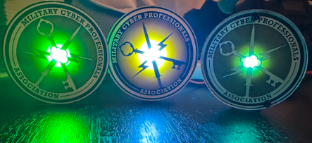
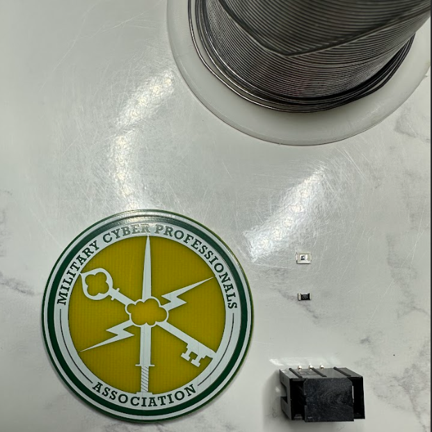

# MCPA Challenge Coin Assembly Guide

A how-to-guide for the MCPA Challenge Coin [simple add on](https://hackaday.com/2019/03/20/introducing-the-shitty-add-on-v1-69bis-standard/) (SAO). 

## Overview 

First off, to those who receive these, thank you for your contribution to the Military Cyber community. The United States depends on individuals like you to achieve great things. This coin symbolizes significant contributions to the United States, the Cyber Community, or MCPA itself. Different versions of the MCPA coin are currently in circulation and can be awarded for various achievements, such as contributions to the organization or performance-based recognition. These coins are made in the USA and are more sustainable for military units and cyber entities alike compared to traditional metal coins. And … they light up! These coins can be attached to the DEFCON Badge or the Hammercon Badge SAO port and light up if assembled correctly. 

## Parts and Equipment

### A breakdown of equipment needed: 

[1x Solder Iron](https://www.digikey.com/en/products/detail/apex-tool-group/WLIRPK8012A/15713284)

[12 inches minimum of Lead Free Solder](https://www.digikey.com/en/products/detail/chip-quik-inc/SMDSWLF-020-1OZ/2177056)

[1x Flux Tube](https://www.digikey.com/en/products/detail/chip-quik-inc/SMD291NL/1160000)

[1x Tweezers](https://www.digikey.com/en/products/detail/seeed-technology-co-ltd/404070001/5488233)

### Parts

[Green LED](https://www.digikey.com/en/products/detail/w%C3%BCrth-elektronik/150120GS75000/4489936) - You can change if you use the voltage as 3.3v in this calculator [here](https://www.digikey.com/en/resources/conversion-calculators/conversion-calculator-led-series-resistor?msockid=334d848d252069f6169b907a24b96820) and get your resistor value

[Resistor](https://www.digikey.com/en/products/detail/stackpole-electronics-inc/CSRT1206FT5R00/16202867)

[SMD 3x2 Pin SAO Connector](https://www.digikey.com/en/products/detail/cnc-tech/3020-06-0300-00-TR/14552462?s=N4IgTCBcDaIMwAYwILQIGxsahqAuATiALoC%2BQA)

### Extra equipment (not necssary):

[1x Roll Solder Wick](https://www.digikey.com/en/products/detail/techspray/1811-5F/7914502) 

[1x Magnifying Light](https://www.amazon.com/IVMAIE-Rectangle-Magnifying-Stepless-Magnifier/dp/B0DBQTT3K3/ref=sr_1_1_sspa?crid=1BLCYOFG619UK&dib=eyJ2IjoiMSJ9.jsqAnrPzagr98MOoMF75dV21gGrTVtx5IrvRZlkXHh46LOfjd0dlzm_lpIACp4QXL1kTVuVPZsE9kx1DBlpJzvz8WBzrJPbyRi2r8Mn51wizjpVa-0L6OKJY7TzopU_jxMVLWMsPCb9WY9g6W95kMj4ut9eHXK5O5DP-cBV5D1RjghfcArjbSgqtQBp083LsjVHwrhYK-MXCOxCMarwGEkTbmExWc_z5vYz5JdK-h3AIWPkstzmO8gKbFsGh56Yg8F455sdq84jfP1zRAuE8I81MLdZbkd_oe0CXHc1B8do.zac-GAshaIoUZihpXh67VGy_GrrgT9Ahfj4Z3M1fm7Q&dib_tag=se&keywords=desk+mount+magnifying+glass+with+light&qid=1736018953&sprefix=desk+mount+magnifying+glass+with+ligh%2Caps%2C232&sr=8-1-spons&sp_csd=d2lkZ2V0TmFtZT1zcF9hdGY&psc=1) 

## Assembly

In the image above I have laid out my led, resistor, SAO connector, coin, and solder. These are the core components for the MCPA Challenge Coin. 